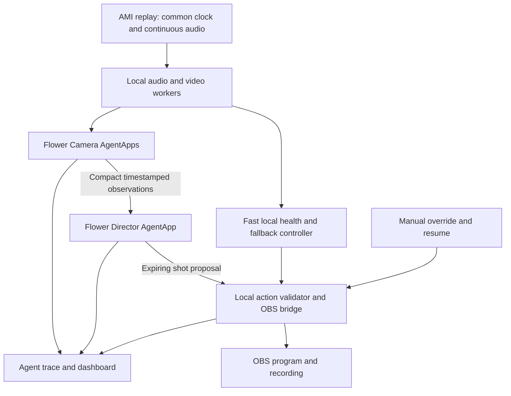

# Noesis
## Autonomous production crew for panel discussions

Updated: 28 September 2026.

**Noesis uses Flower agents to follow a conversation, choose camera shots, and control OBS automatically, while a local production controller keeps the program running through camera and agent failures.**

An organizer configures the sources and presses Start. The system directs and records the discussion without requiring approval for individual cuts. A manual override is available whenever the organizer wants to take control.

This document covers the product, architecture, Flower integration, AMI test data, implementation sequence, and demo. Performance values are acceptance targets, not guarantees.

**Implementation:** the local controller, dashboard, shared-clock replay adapter, five separate Flower 1.39.0 AgentApps, and the OBS browser-source bridge are built. Start with `start.ps1 -OBS`; operational instructions and measured results are in `README.md` and `docs/VALIDATION.md`. At the user’s request, the Director defaults to model-free rules. Model-backed inference remains optional and unverified. A complete 20-second AMI excerpt now works through OBS with camera changes and non-silent audio. Synthetic failure recovery, manual latch, pause, EOF, and agent-outage fallback are also verified. A longer AMI editorial evaluation and fine A/V alignment remain outstanding.

## 1. Problem and outcome

Small panels, university events, and community discussions often have several cameras but no dedicated operator to switch between them. Leaving one wide shot on screen loses detail; assigning someone to switch cameras creates a continuous staffing requirement.

Noesis turns those fixed camera feeds into a coherent program recording. It follows sustained speaker changes, avoids distracting cuts during brief interjections, uses a room view when evidence is ambiguous, and recovers automatically when a source becomes unusable.

The hackathon deliverable is a working demonstration on synchronized meeting footage, with actual Flower execution, an OBS recording, visible source health, and measured recovery from a camera fault.

## 2. MVP scope

**User:** a student society, community organizer, or small conference recording a seated discussion without a dedicated camera switcher.

**Input:** three to five fixed camera views; for the AMI demo, four close-ups and one Corner view. Isolated participant microphones are an explicit MVP assumption. Handling arbitrary mixed-audio events is a later capability.

**Output:** a continuous OBS program recording, live source-health display, and a concise explanation of actual shot decisions.

Must ship:

1. Replay a selected 2–3 minute AMI segment in real time, showing available angles and program output.
2. Identify sustained speaker changes using only audio/video available up to the current replay time.
3. Use genuine Flower camera agents and a Director AgentApp to exchange observations and make editorial choices.
4. Select cameras automatically inside one shared-clock program page captured by OBS, while preserving continuous audio.
5. Inject a visible camera failure and recover to a usable view without an operator or an LLM response.
6. Continue conservatively during agent/model outages; show a clear degraded-mode indicator.
7. Offer a latched manual override and explicit Resume Autopilot action.

A deterministic action validator provides the essential cut checks. Additional event types, highlights, slide understanding, and a separate critic are stretch features after the core loop passes its acceptance checks.

## 3. System architecture



### Responsibilities

| Component | Work | Runtime |
|---|---|---|
| Replay controller | Source clock, start/pause/seek, epoch changes, source-to-participant mapping | Local process |
| Perception workers | VAD, audio levels, decode health, brightness, simple face/framing evidence | Local, independent of LLM calls |
| Camera AgentApp instances | Own one camera's evidence and history; report availability, framing and shot suitability; reply to Director requests | Flower processes; native SuperNode placement preferred after integration gate |
| Director AgentApp | Resolve competing observations, maintain editorial state, choose hold/close-up/wide, explain the choice | Flower at SuperLink |
| Production controller | Validate current health, expire stale commands, enforce override, switch to fallback, verify OBS state | Local deterministic service |
| Dashboard | Program preview, source health, speaker evidence, executed decision reasons, mode | Small web UI |

A camera agent need not call a language model on every observation. Numerical perception should be computed directly. An optional image-capable model may interpret ambiguous framing at a low rate only after its availability and latency are verified. In the MVP, the Director can reason over structured evidence using a text model.

### Two timing paths

**Fast path:** check capture/decode health approximately every 100–250 ms. If the on-air source becomes unusable, select a healthy fallback immediately. Initial recovery target: within 1 second of injected fault onset. Measure it; it is not a platform guarantee.

**Editorial path:** request a Director decision on a sustained speaker change, significant shot-quality change, or a periodic low-rate refresh. Use at most one outstanding decision per broadcast session. Coalesce changes into the latest snapshot; discard obsolete responses. Start with a 2-second request deadline and measure whether the available model can meet it. A timeout activates the deterministic directing baseline, not an unbounded queue.

The model should add editorial judgment: avoid cutting for a short interruption, hold an appropriate shot, select wide during overlap, or weigh an obstructed speaker view against a clear contextual view. Evaluate the editorial contribution against the same system using only VAD, hold rules, and health checks.

## 4. Flower integration

### Runtime and APIs

Flower's AgentApp runtime exposes `AgentSession`, `Context`, runtime model access, connectors, and run events. Its model endpoint credentials are injected inside the AgentApp process; that endpoint is not an external API for the dashboard. `agent.events.emit(...)` publishes trace/UI events, not an application-wide pub/sub bus. Context persistence belongs to a run series, not automatically to every agent. One FAB declares an `agentapp` component or the `serverapp`/`clientapp` pair; do not mix the two. [Runtime documentation](https://flower.ai/docs/agent/explanations/agentapp-runtime.html)

Flower 1.38 introduced experimental AgentApps on SuperLink and SuperNodes, with discovery and JSON messaging through Grid tools. The implemented MVP uses separately executed AgentApps and an application-managed local HTTP observation broker; native Grid messaging is a later integration. Keep video in the local media pipeline. [Release announcement](https://preview.flower.ai/blog/2026-09-22-announcing-flower-1.38-release)

The documented Python interface is `agent.grid.tools()` for schemas and `agent.grid.call(tool_call)` for execution. Discover the actual `get_nodes`, `push_messages`, and `pull_messages` tool schemas in the installed version. Use the returned tool schemas to construct valid calls for the pinned version. [AgentGrid API](https://flower.ai/docs/framework/main/en/ref-api/flwr.agentapp.AgentGrid.html)

### Deployment decision

Run **a local SuperLink**, on the host that can reach the media/OBS bridge. The implemented topology is four camera AgentApps and one Director AgentApp, each submitted as its own Flower run on this laptop. They communicate through the HTTP broker. Demonstrating native SuperNode messaging or a camera agent on a teammate’s laptop is a stretch goal.

The Community Edition guide supports local AgentApp execution without a SuperGrid account. Model inference requires an endpoint compatible with Open Responses; the implemented rules-mode AgentApps execute without model credentials. It documents `uv run flower-superlink --insecure`, a `local-agent` connection to `127.0.0.1:8000`, and `uv run flwr run . local-agent --stream`. Use one environment for CLI and runtime. Local insecure ports stay on the development host. Provider configuration belongs in the SuperLink environment. [Local setup](https://flower.ai/docs/agent/how-to-guides/run-with-local-superlink.html)

Hosted SuperGrid is an optional deployment, not a prerequisite for the media demo. A hosted process cannot access `E:\...` or the laptop's `localhost`. Moving there requires a reachable authenticated bridge or proven node messaging to a local controller. Keep raw video local in the MVP; transmit compact observations. This reduces transmitted media but does not mean observation text never reaches a hosted model.

### First build gate: 30–45 minutes

1. Select and pin the actual available Flower version, matching CLI, runtime, generated template, and SDK. The tutorial checked on 28 September 2026 targets 1.39.0, while the 1.38 release introduced federation support. Confirm the version actually available to the team and keep all components aligned.
2. Generate the official AgentApp template, build the FAB, and execute one model response through Flower. Use an available model name from the team's account/provider and verify access before selecting it for the demo. [First AgentApp tutorial](https://flower.ai/docs/agent/tutorials/write-your-first-agentapp.html)
3. Discover Grid schemas. Prove a Director ↔ camera-node JSON request/reply using sequence numbers; save trace, run IDs, node IDs, version, and round-trip time. Verify node-side AgentApp startup using that version's supported procedure. Record the working node startup procedure alongside the project setup instructions.
4. Prove that the Director process can send an expiring proposal to the local bridge, which acknowledges receipt without yet switching OBS.
5. Stop a camera agent and show that its data becomes stale while the local controller keeps running.

If native Grid cannot be made operational within the gate, use separately executed Flower AgentApps communicating through our own local HTTP/WebSocket broker. Label it **Flower AgentApps with application-managed messaging**. It remains real Flower execution, with optional model access through the injected Flower runtime endpoint, but does not prove native federation messaging. The model-free mode does not claim an LLM call. If only one AgentApp works, disclose the reduced topology and prioritize getting another genuine agent running over adding UI features.

### Runtime rules for this app

- Use bounded session runs for the demo, with explicit stop handling and finite model/tool budgets. Do not spawn a fresh CLI/FAB run each second.
- Implement health heartbeats outside any blocking model loop.
- Keep a bounded observation window and a small shot-history summary; do not resend entire transcripts or video histories.
- Use runtime model credentials only inside agents; OBS credentials stay in the bridge. Exclude media, secrets, and generated logs from FABs.
- Emit trace events for observation, proposal, rejection, executed cut, timeout, and fallback. The execution log must distinguish an agent proposal, a controller-confirmed program camera change, and an OBS-confirmed recording/scene state.

## 5. Perception and media pipeline

### Speaker evidence

Use one mapped microphone channel per participant. Start with VAD plus short-window RMS energy normalized against each channel's noise floor. Add roughly 300–500 ms confirmation and hangover to avoid switching on isolated sounds. These are tunable starting values.

Raw loudest-channel selection is insufficient because microphones have different gains and cross-talk. Calibrate on an initial development interval, then lock thresholds before evaluation. If evidence is ambiguous or multiple speakers are active, retain a suitable shot or choose Corner. Use `unknown` where evidence is missing; do not turn heuristic scores into seemingly calibrated probabilities.

ES2002a has a documented headset problem. Inspect all four channels and use the affected participant's verified lapel channel if needed. Do not assume the documentation's phrase “participant 1” means zero-based microphone channel 1. The exact mapping and preparation procedure are in Section 6.

### Health and shot suitability

- Decoder errors, missing frames, stale arrival times, and stalled source timestamps are strong health evidence.
- Sustained near-black imagery can flag unusable video with a debounced threshold.
- Repeated pixel hashes can support a freeze suspicion, but low motion alone cannot prove a fault.
- A face absent or turned away means reduced shot suitability, not necessarily a disconnected camera.
- Require a short healthy recovery interval before re-enabling a failed source.

### One timeline, one audio path

Replay only frames/audio whose source time is at or before the current media clock. Pause/seek increments a session epoch, clears pending decisions, and realigns all sources. Perception must observe the same point in the recording as OBS, not a decoder racing ahead through the file.

The implementation uses one shared monotonic media clock and one OBS Browser Source at `/program?obs=1`, in the actual `NOESIS_Program` scene. The controller selects camera JPEGs within this program page; independent OBS media-source clocks are not used. Browser-source shutdown/restart-on-activation are disabled. The source updates near 10 fps, while OBS records at 30 fps; full-motion transport is a later improvement.

Use the headset mix as one persistent audio element in the program page, with OBS Browser Source audio routed into the recording; individual analysis microphones are not output. If the mix is unsuitable, prepare and document a replacement using verified channels. Camera changes must never restart, duplicate, or remove program audio.

Initial synchronization target: under 100 ms measured discrepancy at the beginning, middle, and end of the demo clip. If independent playback cannot stay aligned, implement one shared-clock replay producer before adding features. Resolve drift before recording the final demonstration.

## 6. AMI ES2002a test data

Use **AMI Meeting Corpus, session ES2002a**, as the first test fixture: four close-ups, a Corner room view, individual microphones for analysis, and one continuous mix for output.

Public documentation confirms the file listings, camera/channel mapping, license statement, and known defects below. Downloading, decoding, listening, and measuring alignment are the data-preparation gates.

### Available recordings and annotations

AMI describes approximately 100 hours of multimodal meetings with individual and room cameras, microphone recordings, and annotations. Use it to exercise fixed-camera discussion directing; editorial cut quality requires our own evaluation. [Corpus overview](https://groups.inf.ed.ac.uk/ami/corpus/)

The official ES2002a video index lists `Closeup1.avi` through `Closeup4.avi`, `Corner.avi`, and `Overhead.avi`, along with much larger `_orig.avi` versions and smaller RealMedia alternatives. The downloader supports AVI or RM prefixes for a short preview; use full files for the longer evaluation. [Video inventory](https://groups.inf.ed.ac.uk/ami/AMICorpusMirror/amicorpus/ES2002a/video/)

The audio index lists the four `Headset-N.wav` files, four `Lapel-N.wav` files, `Mix-Headset.wav`, and RealMedia alternatives. Preserve the exact names, including capital letters and hyphens. [Audio inventory](https://groups.inf.ed.ac.uk/ami/AMICorpusMirror/amicorpus/ES2002a/audio/)

The download page provides manual annotations v1.6.2, approximately 22 MB. Their `corpusResources/meetings.xml` is the machine-readable mapping to validate against the table below. Words/transcription support reference speaker timing; they are not camera-cut ground truth. [Download page](https://groups.inf.ed.ac.uk/ami/download/), [transcription documentation](https://groups.inf.ed.ac.uk/ami/corpus/transcription.shtml)

### Camera and microphone mapping

| Participant annotation ID | Scenario role | Video | Individual headset |
|---|---|---|---|
| A | Industrial designer | `ES2002a.Closeup1.avi` | `ES2002a.Headset-0.wav` |
| B | Project manager | `ES2002a.Closeup4.avi` | `ES2002a.Headset-1.wav` |
| C | User-interface designer | `ES2002a.Closeup2.avi` | `ES2002a.Headset-2.wav` |
| D | Marketing expert | `ES2002a.Closeup3.avi` | `ES2002a.Headset-3.wav` |

Room fallback: `ES2002a.Corner.avi`. Overhead is optional. The signals documentation lists session length as 1242 seconds; verify actual stream durations with ffprobe rather than treating this metadata value as an exact endpoint. Do not reuse the mapping for other sessions: seat/camera assignments can change. [Official signals and mappings](https://groups.inf.ed.ac.uk/ami/corpus/signals.shtml)

### Known defects and attribution

AMI's problem table records that “participant 1” in ES2002a/b/c did not wear the headset correctly; the corresponding lapel recording is reported usable. It also records incomplete presentation capture in ES2002a. Therefore, do not use this meeting to demonstrate reliable slide understanding. Do not silently interpret “participant 1” as a microphone channel number. Resolve the affected person's identity using metadata plus listening and visible speaking turns, then record the replacement channel. [Known data problems](https://groups.inf.ed.ac.uk/ami/corpus/dataproblems.shtml)

The official corpus license page identifies the AMI corpus and annotations as **CC BY 4.0**. Credit the source and license, preserve supplied notices, and state modifications such as trimming, conversion, overlays, or injected faults. Do not imply endorsement. [AMI license](https://groups.inf.ed.ac.uk/ami/corpus/license.shtml)

Suggested credits text, to include in the README and an accessible demo credits panel, adjusted to describe the actual modifications:

> Source footage and audio: AMI Meeting Corpus, session ES2002a, AMI Project. Source: https://groups.inf.ed.ac.uk/ami/corpus/. Licensed under Creative Commons Attribution 4.0 International: https://creativecommons.org/licenses/by/4.0/. Noesis modifications: selected excerpts, transcoding, automatic camera selection, and labeled simulated camera faults. No endorsement by the source creators is implied.

Carry through any additional creator attribution supplied in the downloaded package. Include the credit in exported demo materials, not only a private development file.

### Download inventory

Base video directory: [ES2002a/video](https://groups.inf.ed.ac.uk/ami/AMICorpusMirror/amicorpus/ES2002a/video/).

| File | Listed size, approximate |
|---|---:|
| `ES2002a.Closeup1.avi` | 58 M |
| `ES2002a.Closeup2.avi` | 38 M |
| `ES2002a.Closeup3.avi` | 37 M |
| `ES2002a.Closeup4.avi` | 40 M |
| `ES2002a.Corner.avi` | 48 M |

Base audio directory: [ES2002a/audio](https://groups.inf.ed.ac.uk/ami/AMICorpusMirror/amicorpus/ES2002a/audio/).

| Files | Purpose | Listed size, approximate |
|---|---|---:|
| `ES2002a.Headset-0.wav` through `ES2002a.Headset-3.wav` | Causal speaker evidence | 39 M each |
| `ES2002a.Mix-Headset.wav` | Continuous program audio, subject to listening check | 39 M |
| Needed `ES2002a.Lapel-N.wav` | Replace confirmed weak headset for analysis if appropriate | Check selected file |

The five videos plus five primary audio files total approximately 416 M using the directory's rounded size units; annotations and replacement lapel audio are additional. These are index values, not measured local downloads. No need to download all 100 hours or the large `_orig` videos.

Keep raw files in a dedicated ignored data directory. Record each exact source URL, retrieval date, local filename, byte length, SHA-256, and ffprobe result in a manifest after downloading. A public listing verifies that a file is listed; successful retrieval and decoding still need checking.

**Installed smoke-test fixture:** `data/ami/ES2002a/prepared/clip-0-20/manifest.json` describes all ten validated derivatives. Closeup1 and Corner use official RM prefixes, Closeups 2–4 use cached AVI prefixes, and all five audio channels use RM prefixes. The prepared outputs are about 19.93–20 seconds long. All audio receives the same fixed +18 dB gain; the largest sample peak is 0.531, below clipping. Prefixes remain explicitly incomplete originals. The actual OBS test produced a 20-second recording with non-silent audio and automatic camera selection. Source playback metadata supports a shared zero origin; fine lip sync still needs measurement. The resumable command and evidence are in `README.md` and `docs/VALIDATION.md`.

### Preparation procedure

1. Download the five small videos, four headset files, mix, and manual annotations using the official index/download page. Retain original media unchanged.
2. Probe every stream for codec, dimensions, frame rate, sample rate, start time, and duration. Decode-check all media used in the demo. Stop and investigate unequal lengths or timestamp discontinuities.
3. Read the ES2002a entry in `corpusResources/meetings.xml`, compare it with the mapping above, and confirm at least one visible speaking turn for each participant.
4. Listen to the four headset channels individually. Identify clipping, weak signal, and cross-talk. If replacing a channel, confirm the lapel participant mapping and alignment before substitution. Recheck the mixed program audio separately.
5. Find a development excerpt with multiple sustained speaker turns, a short interjection, and some overlap. Select a separate evaluation interval. Choose the final demo interval after inspecting its speaking turns and shot quality.
6. Determine the common usable time range. Check audio/video alignment at several visible utterances and at the start and end of each chosen excerpt. Do not assume equal trim offsets fix underlying misalignment.
7. Transcode all selected streams with the same source interval and timestamp convention. Preserve or explicitly normalize source offsets. Prefer re-encoding for accurate trim boundaries; keyframe-only stream copying may start different views at different moments.
8. Record transforms and source-to-output time offsets. Use one timeline for both OBS playback and perception. No source may restart just because its scene becomes visible.
9. Play through twice, switching among every view, and inspect the resulting recording for jumps, lip-sync drift, doubled audio, or silence on cuts.

Example inspection commands, run after files exist (PowerShell):

```powershell
ffprobe -v error -show_entries format=start_time,duration:stream=index,codec_type,codec_name,width,height,r_frame_rate,sample_rate,channels,start_time,duration -of json "data/ami/ES2002a/video/ES2002a.Closeup1.avi"
ffmpeg -v error -i "data/ami/ES2002a/video/ES2002a.Closeup1.avi" -f null -
Get-FileHash -Algorithm SHA256 -LiteralPath "data/ami/ES2002a/video/ES2002a.Closeup1.avi"
```

Repeat the inspection for every selected video/audio file. Complete these checks on the downloaded files before accepting the fixture.

### Reference labels and live perception

Provide two visibly distinct modes:

- **Oracle/plumbing mode:** reference speaking labels drive synthetic camera observations to test Flower messages and OBS control. Useful early, but not a perception result.
- **Perception mode:** audio/video up to current replay time drives observations. Annotation files are available only to an offline evaluator, not to the live agents or their prompts.

Derive reference speaking intervals from participant word/segment timing, merge appropriate short gaps, and exclude non-speech labels. Word timing is not a perfect manual broadcast boundary: AMI's overview describes forced alignment of manually transcribed words. Choose and document a small boundary tolerance before evaluation. Report overlap and silence separately. [Annotation overview](https://groups.inf.ed.ac.uk/ami/corpus/overview.shtml)

Do not give the Director a full future transcript. If transcription is later added, only completed causal chunks can enter its context.

## 7. Decision and OBS execution contract

Use typed application schemas. The following is an illustrative proposal, not a Flower-native message schema:

```json
{
  "schema_version": 1,
  "broadcast_id": "demo-001",
  "epoch": 3,
  "request_id": "r-042",
  "decision_id": "d-042",
  "source": "director",
  "observation_seq": {"closeup1": 211, "closeup2": 210, "closeup3": 212, "closeup4": 209, "corner": 213},
  "media_time_ms": 42800,
  "action": "switch",
  "target_scene": "LD_Corner",
  "reason_code": "speaker_view_unusable",
  "reason": "The speaking participant's close-up is obstructed; the room view remains usable.",
  "override_epoch": 2
}
```

The bridge issues the decision request ID and stores its deadline using its own monotonic clock. Responses must match that request, broadcast, replay epoch, and override epoch; the model cannot extend the deadline. This avoids comparing monotonic clocks across computers.

Before every action, the bridge checks schema, scene allowlist, deadline, newness, latest target health, current mode, and shot duration. Re-check evidence when newer observations supersede the proposal. Serialize OBS writes and deduplicate decision IDs. Reject stale proposals after a source recovers, fails, or the operator intervenes.

Initial policy:

- Normal close-up hold: approximately 4 seconds. Brief interjections do not force a cut.
- A maximum shot length is a preference, not a reason to abandon a useful speaker shot.
- Emergency failure recovery bypasses minimum hold time.
- Healthy Corner is the default uncertainty/failure fallback. If unavailable, use a healthy alternative or a multiview of healthy sources; if none exist, show a branded unavailable slate.
- Manual override latches until Resume Autopilot. It disables automatic cuts, including automatic fallback; still show health warnings. A late model response cannot undo the override.

Use obs-websocket v5 request names: `SetCurrentProgramScene`, `GetCurrentProgramScene`, `StartRecord`, `StopRecord`. These are protocol names; Python wrapper method names may differ. Check request success and resulting scene state; log failures without pretending a cut happened. [Official protocol](https://raw.githubusercontent.com/obsproject/obs-websocket/master/docs/generated/protocol.md)

For this MVP the bridge’s agent-facing action is only hold/switch among allowed camera IDs. OBS stays on the single `NOESIS_Program` scene; internal camera cuts are not described as OBS scene changes. Start/stop of recording belongs to the session controller. Use local recording for the demo; public streaming is unnecessary.

## 8. Dashboard and operator workflow

The dashboard should make the program and its operating state immediately understandable:

- **Program preview:** the actual OBS output, with the current scene and recording status.
- **Source strip:** four participant thumbnails plus Corner, showing availability, speaker evidence, and the age of the latest observation.
- **Decision timeline:** concise reasons for executed cuts, including whether they came from the Director or the fallback controller. Rejected proposals are visibly separate.
- **Operating mode:** Autopilot, Manual, or Degraded, with a clear explanation when a dependency is unavailable.
- **Controls:** Start Session, Stop Session, scene selection for manual override, Resume Autopilot, and labeled test-fault controls.
- **Credits:** accessible AMI attribution and a clear label that the demo uses real-time replay of recorded footage.

Session flow:

1. Load the source manifest and confirm the required cameras, audio mix, Flower connection, and OBS scenes are ready.
2. Prime the media sources on the common timeline, start recording, and enter Autopilot.
3. Show scene changes and source health without asking the operator to confirm routine decisions.
4. If the operator selects a scene, latch Manual mode and invalidate outstanding automatic decisions.
5. Resume Autopilot explicitly; obtain fresh observations before making the next automatic cut.
6. On Stop Session, cancel pending work, stop replay and recording, and save the recording path, decision log, and run metadata.

## 9. Build sequence and ownership

Suggested split for two teammates; durations are planning estimates, not a confirmed event schedule.

| Stage | Person A | Person B | Exit evidence |
|---|---|---|---|
| First 45 minutes | Flower run, messaging, bridge reachability | Download/probe sources, verify mappings and audio defect | Real Flower trace; playable test sources |
| Next 1–2 hours | Local controller, OBS scene switching, override | Replay clock, continuous mix, perception baseline | Coherent recorded clip with automatic baseline cuts |
| Next 1–2 hours | Director schema, deadlines, agent history | Camera AgentApps and compact observations | Flower proposals produce acknowledged OBS changes |
| Next hour | Fault handling, stale reply rejection | Dashboard with actual mode and health | Blackout and agent timeout recover autonomously |
| Remaining time | Evaluate baselines and failure scenarios | Polish layout, credits, demo narrative | Repeatable demo and recorded backup |

Prefer Python with one locked environment, FFmpeg/OpenCV for media work, one VAD implementation, a small HTTP/WebSocket bridge, one obs-websocket client, and a lightweight web UI. Avoid introducing a second orchestration framework. Choose a Python version supported by all pinned packages; do not assume the machine's existing Python is compatible.

If time becomes tight, reduce to two close-ups plus Corner and choose a segment with those two speakers. Unrepresented speakers still require a wide shot. Preserve failover, continuous audio, honest Flower execution, and the override latch. Remove highlights and polish first.

## 10. Testing and acceptance targets

Use a development clip and a separate evaluation interval with thresholds fixed. The targets below must be measured on the demo machine.

| Measure | Initial target / required behavior |
|---|---|
| Autonomous operation | Full selected clip without required human cut approvals |
| A/V synchronization | Measured discrepancy below 100 ms at three points; continuous audio across cuts |
| Active source black/dropout | Usable fallback visible within 1 second of injected onset in at least 95% of repeated trials |
| Agent/model outage | No queued stale cuts; local baseline continues and UI marks degraded operation |
| Stale/duplicate decisions | Zero executed actions from an old epoch, expired request, or duplicate ID |
| Manual override | Zero automatic cuts until explicit resume, including delayed responses |
| Speaker following | Report eligible single-speaker duration on correct close-up, coverage, and handoff delay; provisional target ≥80% correct close-up coverage on the chosen evaluation interval |
| Cut quality | Report short shots and unnecessary cuts; compare against strongest valid microphone + hold + health baseline |
| Evidence | Save input interval, versions, seeds/fault schedule, decision log, OBS-confirmed scene timeline, and program recording |

Do not score the LLM's own explanation as correctness. Separate overlap, silence, and periods with no usable close-up; report their durations rather than removing them silently. No metric should use a future annotation as an input to the live decision.

### Fault and behavior fixtures

Inject faults into the shared source path so that perception and OBS receive the same fault. A black box added only to the dashboard does not test output recovery. Store a reproducible fault schedule separately; the controller must detect the fault rather than being told its ground-truth onset.

| Fixture | Expected result |
|---|---|
| Normal sustained turns | Follow speakers with bounded delay and limited unnecessary cuts |
| Brief backchannel or interjection | Avoid immediate camera ping-pong |
| Overlap or silence | Hold an appropriate view or select Corner; avoid inventing a unique speaker |
| Static participant with healthy advancing frames | No false disconnect merely because motion is low |
| Active source black for 10 seconds | Detect, cut to healthy fallback, debounce recovery |
| Stalled decode / missing heartbeat | Source becomes unavailable even if its last image looks normal |
| Repeated frame payload with advancing timestamps | Flag suspected freeze using combined evidence; measure false positives |
| Corner unavailable plus close-up fault | Use another healthy option or slate; never assume wide is healthy |
| Camera AgentApp stopped | Expire its evidence and remain operational |
| Director/model delayed beyond deadline | Drop late answer; continue baseline and display degraded mode |
| Manual override during outstanding decision | No automatic cut until resume; late response rejected |
| Duplicate, out-of-order, or old-epoch response | Zero execution of invalid commands |
| Pause, seek, and resume | All sources realign; prior decisions invalidated |
| OBS disconnected or rejects scene | Report inability to execute; reconcile current state after reconnect without replaying old cuts |

For black/dropout latency, use repeated injections at different eligible on-air moments. Log time of injected onset, detector declaration, bridge command, OBS acknowledgment, and first usable output frame. An acknowledgment alone is not proof the viewer saw a healthy frame.

### Evaluation procedure

Compare three modes on identical intervals:

1. Always Corner: continuity reference.
2. VAD/normalized microphone score + hold + health rules: simple automatic-director baseline.
3. Flower agents + editorial Director with the same perception and fallback controller.

Report:

- Duration-weighted correct close-up coverage during eligible single-speaker speech, and handoff delay distribution.
- Time on wide, healthy close-ups, unavailable scenes, overlap, silence, and unrepresented speakers. Include the denominator and any boundary tolerance.
- Cut count, very short shots, and unnecessary changes during uninterrupted speech.
- Failure recovery latency distribution and false alarms on healthy/static footage.
- Timed-out model calls, degraded-mode duration, rejected stale decisions, and any override violations.
- Human review of whether the recording is watchable; AMI does not supply the unique correct editorial cut sequence.

Use a separate held-out time interval for evaluation; do not tune thresholds on every measured failure and report the same interval as independent validation. With only ES2002a, conclusions are limited to a small controlled replay. Validate a second meeting or a real two-camera conversation later before claiming broad event coverage.

## 11. Two-minute judge demo

1. **Problem and start:** “Small panels have cameras but no one to direct them. Noesis runs the program automatically.” Start replay and show the actual program output.
2. **Conversation:** show a sustained speaker change, a short interruption held appropriately, and agent observations behind the resulting cuts.
3. **Resilience:** visibly inject a camera blackout. Show the output recover and the measured delay. Label the injection as a test.
4. **Collaboration:** show genuine Flower run/node identities and exchanged observations. Use a real disagreement only if one occurs; do not fabricate debate or confidence values.
5. **Control and result:** briefly demonstrate the override latch, resume, and show the recorded output with credits.

The strongest claim to earn is: **autonomous directing that remains usable when observations conflict or a component fails.** AMI demonstrates controlled discussion replay; it does not validate sports, concerts, or arbitrary live venues.

## 12. Stretch features

Add these in priority order only after the autonomous directing loop is reliable:

1. Run a camera AgentApp on a teammate's machine and demonstrate its real contribution through Flower messaging.
2. Add low-rate visual interpretation for ambiguous framing or occlusion, using a verified image-capable model.
3. Add optional directing styles, such as longer holds for a formal panel or more frequent room views during discussion.
4. Generate timestamped highlight markers from events already observed, then assemble a reel after recording.
5. Add an asynchronous critic that audits decisions without blocking the live output.
6. Test another meeting and a real two-camera conversation before expanding to new event types.

## 13. Completion checklist

- [x] Flower 1.39.0 and five separate AgentApp runs proved through the application-managed HTTP broker; real rules-director cuts recorded.
- [ ] Optional model inference verified after credentials are configured.
- [x] Complete 20-second prepared AMI excerpt acquired; source hashes and derivative decoding recorded.
- [ ] Longer 2–3 minute AMI segment acquired and fine A/V alignment measured.
- [ ] Weak ES2002a microphone identified; any lapel replacement mapped and measured.
- [x] Causal perception separated from reference annotations; decoder/VAD and fault fixtures tested.
- [x] Actual OBS video and non-silent persistent program audio verified in the 20-second AMI recording.
- [ ] Fine audio continuity and lip sync measured across a longer sequence of cuts.
- [ ] Evaluation targets measured, including timeout and stale-override races.
- [ ] Current event submission requirements and judging criteria confirmed against the organizer's brief.
- [x] AMI credit included in the dashboard, README, and exported demonstration.
- [x] Generated-input demo rehearsed and a backup OBS recording saved; manual latch, pause, EOF, agent outage, and external OBS stop tested.
- [ ] Full real-footage demo rehearsed after AMI acquisition and synchronization checks.

Current local evidence is in `docs/VALIDATION.md`: 30 passing tests and a 25.57-second synthetic recording with one Flower director cut. A single black-frame trial selected fallback in 1,016 ms; repeated visible-output latency and the table's editorial/A/V targets are still unmeasured.
