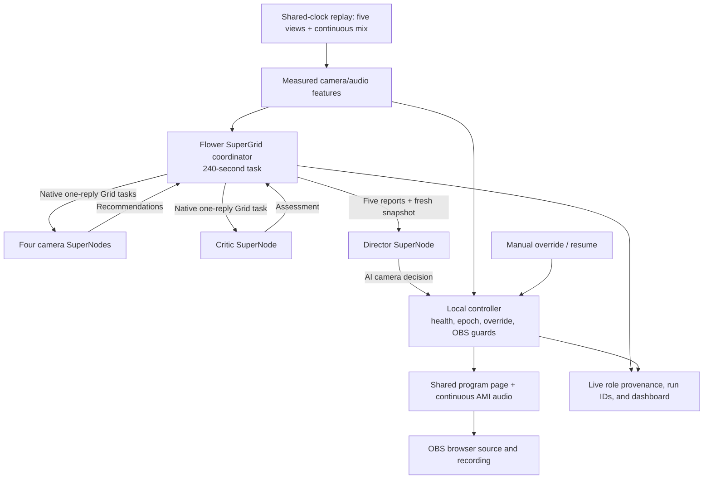

# Noesis
## Autonomous production crew for panel discussions

Updated: 29 September 2026.

**Noesis uses Flower agents to follow a conversation, choose camera shots, and control OBS automatically, while a local production controller keeps the program running through camera and agent failures.**

An organizer configures the sources and presses Start. The system directs and records the discussion without requiring approval for individual cuts. A manual override is available whenever the organizer wants to take control.

This document covers the product, architecture, Flower integration, AMI test data, implementation sequence, and demo. Performance values are acceptance targets, not guarantees.

**Current architecture:** authenticated Flower SuperGrid with a bounded cloud coordinator and six local SuperNodes: four camera agents, a critic, and a director. Native Flower Grid carries one-reply role jobs. All six roles use AI on compact numeric/categorical source measurements; the models do not receive raw frames, audio, transcripts, or annotation labels. The critic runs in parallel with the four camera roles on current measurements and bounded prior-result history; the Director consumes the four camera reports, critic response, and fresh snapshot. The local controller validates results and enforces source health, replay/model/override epochs, manual latch, and OBS state; it does not rank shots with deterministic speaker rules. Kimi is the default and has passed a live six-role round; MiniMax will not be run for this demo. The launcher requires both model profiles to be configured. Browser control-room playback and the `/program` OBS source share the continuous AMI audio mix. Each coordinator task is capped at 240 seconds. All six nodes are online. Kimi run `96528684490097715` returned six accepted role responses and the Director selected Closeup3; source-health recovery passed in 984 ms and manual override passed. The first 30-second round expired, while a later round completed in about 23 seconds. Renewed run `3067815238044157620` was pending at the last check. A seven-file Flower package was built and secret-checked locally, not published. The full suite has 42 passing tests and the fresh AMI/OBS smoke test passed; a separate short AMI replay ended before an AI cut. See `README.md`, `docs/FLOWER.md`, and `docs/VALIDATION.md` for current evidence.

The remainder of this plan retains earlier product hypotheses and evaluation targets. The current architecture paragraph above and `BUILD_CONTRACT.md` supersede any conflicting local-only, rules-director, or editorial-policy descriptions below.

## 1. Problem and outcome

Small panels, university events, and community discussions often have several cameras but no dedicated operator to switch between them. Leaving one wide shot on screen loses detail; assigning someone to switch cameras creates a continuous staffing requirement.

Noesis turns those fixed camera feeds into a coherent program recording. It follows sustained speaker changes, avoids distracting cuts during brief interjections, uses a room view when evidence is ambiguous, and recovers automatically when a source becomes unusable.

The hackathon deliverable is a working demonstration on synchronized meeting footage, with actual Flower execution, an OBS recording, visible source health, and measured recovery from a camera fault.

## 2. MVP scope

**User:** a student society, community organizer, or small conference recording a seated discussion without a dedicated camera switcher.

**Input:** three to five fixed camera views; for the AMI demo, four close-ups and one Corner view. Isolated participant microphones are an explicit MVP assumption. Handling arbitrary mixed-audio events is a later capability.

**Output:** a continuous OBS program recording, live source-health display, and a concise explanation of actual shot decisions.

Must ship:

1. Replay a selected 2–3 minute AMI segment in real time, showing available angles and program output.
2. Identify sustained speaker changes using only audio/video available up to the current replay time.
3. Use genuine Flower camera agents and a Director AgentApp to exchange observations and make editorial choices.
4. Select cameras automatically inside one shared-clock program page captured by OBS, while preserving continuous audio.
5. Inject a visible camera failure and recover to a usable view without an operator or an LLM response.
6. Continue conservatively during agent/model outages; show a clear degraded-mode indicator.
7. Offer a latched manual override and explicit Resume Autopilot action.

A deterministic controller provides essential safety and output checks; the AI Director makes editorial camera choices. The critic is one of the six AI roles. Highlights, semantic slide understanding, and broader event support remain future work after the live federation path and core demo are verified.

## 3. System architecture



### Responsibilities

| Component | Work | Runtime |
|---|---|---|
| Replay and feature path | Common media clock; measured speaker activity, energy, quality, and camera health | Local process |
| Four camera AgentApps | Independently recommend take/hold/avoid from assigned camera measurements | Four authenticated local SuperNodes; model inference through Flower runtime |
| Critic AgentApp | Assess the current measured round and bounded prior-result history as steady/change/wide, independently of the new camera results | Authenticated local SuperNode; parallel model inference through Flower runtime |
| Director AgentApp | Read the four camera reports, critic assessment, and fresh snapshot; choose hold or a camera | Authenticated local SuperNode; model inference through Flower runtime |
| SuperGrid coordinator | Fan out one-reply role tasks, collect their results, ask the Director, and correlate provenance | Bounded cloud Flower run, at most 240 seconds per task |
| Production controller | Validate current identity, health, deadline, replay/model/override epochs; enforce manual latch; drive the shared program and observe OBS | Local service; deterministic checks only |
| Dashboard and output page | Show program, live agent/provenance state, controls, continuous mix, and honest degraded state | Local web UI; `/program` is the OBS browser source |

The model prompt receives only compact numeric and categorical features plus the other agents' structured reports. No role receives raw image/audio data, transcripts, or future annotation labels. A camera agent's recommendation is not a ground-truth speaker label; confidence and reasons remain model outputs. The local controller verifies the current target's health and all provenance just before accepting a Director result.

### Two timing paths

**Control path:** update media time and source-health measurements locally. If the on-air source becomes unusable, the health guard can move to a currently healthy source without waiting for a model. This is source recovery, not an editorial fallback ranking. Measure recovery through the first usable program output; a controller selection alone is not an end-to-end latency result.

**Editorial path:** one coordinator round sends four camera jobs and one independent critic job concurrently. The critic receives the current measured round and bounded prior AI report history; it does not consume or wait for the fresh camera replies. The coordinator gathers all five one-reply results and sends them with a fresh source snapshot to the AI Director. The Director chooses hold or a camera, and the controller accepts only a unique, completed, same-round decision for the current healthy target. Each coordinator run has a 240-second cap. Expired or incomplete AI work cannot produce a cut; the controller keeps the healthy current shot. Manual override, pause/seek/session changes, model switching, stale heartbeats, or source failure block stale results.

Kimi is the default model profile; MiniMax is an optional UI selection when configured. Changing models advances the model epoch and invalidates outstanding work while playback continues. A configured profile is not shown as verified until the controller accepts an actual response.

## 4. Flower integration

### Runtime and APIs

Flower's AgentApp runtime exposes `AgentSession`, `Context`, Grid messaging, the injected model runtime, and run events. The coordinator and local SuperNodes use actual Flower runs. The model endpoint credentials are injected by Flower and route through the configured gateway; they are not browser state. Noesis uses the authenticated `supergrid` connection and `@thesid42/noesis` federation. [Runtime documentation](https://flower.ai/docs/agent/explanations/agentapp-runtime.html)

Native Flower Grid carries the coordinator's role tasks and one-reply responses. The local Noesis HTTP API carries compact measured snapshots, heartbeats, and accepted decisions between the SuperNodes and the media/OBS host. It does not replace Grid messaging. Keep raw video and audio on the local media path.

The implementation uses the pinned Flower 1.39.0 Grid tools exposed by `agent.grid.tools()` / `agent.grid.call(...)` to discover nodes, push tasks, pull messages, and return one reply. The coordinator and worker do not share assumptions about a response until it matches the expected node, message, role, and result schema. [AgentGrid API](https://flower.ai/docs/framework/main/en/ref-api/flwr.agentapp.AgentGrid.html)

### Deployment decision

Run the Flower coordinator on SuperGrid and six authenticated local SuperNodes beside the media/OBS bridge. The repository launcher registers the four camera nodes, critic, and Director under the `@thesid42/noesis` federation, waits for all expected nodes online, then starts a coordinator AgentApp with a 240-second run budget. The application-owned local service serves snapshots and executes validated choices; role-to-role work travels through native Grid messaging.

The event deliverable requires collaborative Flower Agents on SuperGrid and an AgentApp published to Flower Hub. The repository implements the native Grid topology and a 240-second task cap, and all six nodes have been confirmed online in the authenticated federation. Cloud run `96528684490097715` remains `Pending` without execution or logs, so model inference and a full collaborative AI decision are not yet verified. The Hub package has been prepared and secret-checked locally only; it has not been published.

The local SuperNodes reach the media/OBS host at loopback. Only compact measurements and structured reports enter model prompts. Those features and reports are still sent to the selected model provider; they must not be described as staying entirely on the laptop.

### Remaining integration gate

1. [x] Verify all six expected SuperNodes are online in the authenticated federation.
2. Complete an actual coordinator round: four model camera reports, one independent model critic report, and one accepted AI Director decision, all correlated by request and response IDs.
3. Record the managed coordinator run ID/status, each node ID and role, model/profile, accepted response IDs, latency/token metadata, and the controller's decision event. Redact provider keys and private account data.
4. Verify that the decision executes only for a current healthy camera, and show the manual latch rejecting any later automatic result until explicit resume.
5. Exercise the AI timeout path and source-health recovery separately; confirm the program holds a healthy shot when AI is absent and the health guard can leave an unusable camera.
6. Publish the AgentApp to Flower Hub, then complete the team's registration form, description, repository field, and 3–5 minute demo. Do not claim these external deliverables until their completion is confirmed.

### Runtime rules for this app

- Keep every coordinator task at 240 seconds or less, and keep any other Flower task within the event's five-minute cap.
- Keep measured source snapshots and role prompts bounded; do not send raw media, transcripts, annotations, credentials, or unbounded history.
- Use Flower-injected model runtime credentials and the configured loopback gateway; never expose provider or OBS credentials in UI state, Grid prompts, or public logs.
- Preserve request, session, replay, model, and override provenance through every result. Reject malformed, duplicate, expired, stale, or wrong-role replies.
- Emit trace events for task start, accepted camera/critic reports, Director decisions, rejected results, stale/timeout states, manual override, and health recovery. Distinguish a role response from a controller-accepted camera change and from actual OBS recording status.

## 5. Perception and media pipeline

### Speaker evidence

Use one mapped microphone channel per participant. Start with VAD plus short-window RMS energy normalized against each channel's noise floor. Add roughly 300–500 ms confirmation and hangover to avoid switching on isolated sounds. These are tunable starting values.

Raw loudest-channel selection is insufficient because microphones have different gains and cross-talk. Calibrate on an initial development interval, then lock thresholds before evaluation. If evidence is ambiguous or multiple speakers are active, retain a suitable shot or choose Corner. Use `unknown` where evidence is missing; do not turn heuristic scores into seemingly calibrated probabilities.

ES2002a has a documented headset problem. Inspect all four channels and use the affected participant's verified lapel channel if needed. Do not assume the documentation's phrase “participant 1” means zero-based microphone channel 1. The exact mapping and preparation procedure are in Section 6.

### Health and shot suitability

- Decoder errors, missing frames, stale arrival times, and stalled source timestamps are strong health evidence.
- Sustained near-black imagery can flag unusable video with a debounced threshold.
- Repeated pixel hashes can support a freeze suspicion, but low motion alone cannot prove a fault.
- A face absent or turned away means reduced shot suitability, not necessarily a disconnected camera.
- Require a short healthy recovery interval before re-enabling a failed source.

### One timeline, one audio path

Replay only frames/audio whose source time is at or before the current media clock. Pause/seek increments a session epoch, clears pending decisions, and realigns all sources. Perception must observe the same point in the recording as OBS, not a decoder racing ahead through the file.

The implementation uses one shared monotonic media clock and one OBS Browser Source at `/program?obs=1`, in the actual `NOESIS_Program` scene. The controller selects camera JPEGs within this program page; independent OBS media-source clocks are not used. Browser-source shutdown/restart-on-activation are disabled. The source updates near 10 fps, while OBS records at 30 fps; full-motion transport is a later improvement.

Use the headset mix as one persistent audio element in the program page, with OBS Browser Source audio routed into the recording; individual analysis microphones are not output. If the mix is unsuitable, prepare and document a replacement using verified channels. Camera changes must never restart, duplicate, or remove program audio.

Initial synchronization target: under 100 ms measured discrepancy at the beginning, middle, and end of the demo clip. If independent playback cannot stay aligned, implement one shared-clock replay producer before adding features. Resolve drift before recording the final demonstration.

## 6. AMI ES2002a test data

Use **AMI Meeting Corpus, session ES2002a**, as the first test fixture: four close-ups, a Corner room view, individual microphones for analysis, and one continuous mix for output.

Public documentation confirms the file listings, camera/channel mapping, license statement, and known defects below. Downloading, decoding, listening, and measuring alignment are the data-preparation gates.

### Available recordings and annotations

AMI describes approximately 100 hours of multimodal meetings with individual and room cameras, microphone recordings, and annotations. Use it to exercise fixed-camera discussion directing; editorial cut quality requires our own evaluation. [Corpus overview](https://groups.inf.ed.ac.uk/ami/corpus/)

The official ES2002a video index lists `Closeup1.avi` through `Closeup4.avi`, `Corner.avi`, and `Overhead.avi`, along with much larger `_orig.avi` versions and smaller RealMedia alternatives. The downloader supports AVI or RM prefixes for a short preview; use full files for the longer evaluation. [Video inventory](https://groups.inf.ed.ac.uk/ami/AMICorpusMirror/amicorpus/ES2002a/video/)

The audio index lists the four `Headset-N.wav` files, four `Lapel-N.wav` files, `Mix-Headset.wav`, and RealMedia alternatives. Preserve the exact names, including capital letters and hyphens. [Audio inventory](https://groups.inf.ed.ac.uk/ami/AMICorpusMirror/amicorpus/ES2002a/audio/)

The download page provides manual annotations v1.6.2, approximately 22 MB. Their `corpusResources/meetings.xml` is the machine-readable mapping to validate against the table below. Words/transcription support reference speaker timing; they are not camera-cut ground truth. [Download page](https://groups.inf.ed.ac.uk/ami/download/), [transcription documentation](https://groups.inf.ed.ac.uk/ami/corpus/transcription.shtml)

### Camera and microphone mapping

| Participant annotation ID | Scenario role | Video | Individual headset |
|---|---|---|---|
| A | Industrial designer | `ES2002a.Closeup1.avi` | `ES2002a.Headset-0.wav` |
| B | Project manager | `ES2002a.Closeup4.avi` | `ES2002a.Headset-1.wav` |
| C | User-interface designer | `ES2002a.Closeup2.avi` | `ES2002a.Headset-2.wav` |
| D | Marketing expert | `ES2002a.Closeup3.avi` | `ES2002a.Headset-3.wav` |

Room fallback: `ES2002a.Corner.avi`. Overhead is optional. The signals documentation lists session length as 1242 seconds; verify actual stream durations with ffprobe rather than treating this metadata value as an exact endpoint. Do not reuse the mapping for other sessions: seat/camera assignments can change. [Official signals and mappings](https://groups.inf.ed.ac.uk/ami/corpus/signals.shtml)

### Known defects and attribution

AMI's problem table records that “participant 1” in ES2002a/b/c did not wear the headset correctly; the corresponding lapel recording is reported usable. It also records incomplete presentation capture in ES2002a. Therefore, do not use this meeting to demonstrate reliable slide understanding. Do not silently interpret “participant 1” as a microphone channel number. Resolve the affected person's identity using metadata plus listening and visible speaking turns, then record the replacement channel. [Known data problems](https://groups.inf.ed.ac.uk/ami/corpus/dataproblems.shtml)

The official corpus license page identifies the AMI corpus and annotations as **CC BY 4.0**. Credit the source and license, preserve supplied notices, and state modifications such as trimming, conversion, overlays, or injected faults. Do not imply endorsement. [AMI license](https://groups.inf.ed.ac.uk/ami/corpus/license.shtml)

Suggested credits text, to include in the README and an accessible demo credits panel, adjusted to describe the actual modifications:

> Source footage and audio: AMI Meeting Corpus, session ES2002a, AMI Project. Source: https://groups.inf.ed.ac.uk/ami/corpus/. Licensed under Creative Commons Attribution 4.0 International: https://creativecommons.org/licenses/by/4.0/. Noesis modifications: selected excerpts, transcoding, automatic camera selection, and labeled simulated camera faults. No endorsement by the source creators is implied.

Carry through any additional creator attribution supplied in the downloaded package. Include the credit in exported demo materials, not only a private development file.

### Download inventory

Base video directory: [ES2002a/video](https://groups.inf.ed.ac.uk/ami/AMICorpusMirror/amicorpus/ES2002a/video/).

| File | Listed size, approximate |
|---|---:|
| `ES2002a.Closeup1.avi` | 58 M |
| `ES2002a.Closeup2.avi` | 38 M |
| `ES2002a.Closeup3.avi` | 37 M |
| `ES2002a.Closeup4.avi` | 40 M |
| `ES2002a.Corner.avi` | 48 M |

Base audio directory: [ES2002a/audio](https://groups.inf.ed.ac.uk/ami/AMICorpusMirror/amicorpus/ES2002a/audio/).

| Files | Purpose | Listed size, approximate |
|---|---|---:|
| `ES2002a.Headset-0.wav` through `ES2002a.Headset-3.wav` | Causal speaker evidence | 39 M each |
| `ES2002a.Mix-Headset.wav` | Continuous program audio, subject to listening check | 39 M |
| Needed `ES2002a.Lapel-N.wav` | Replace confirmed weak headset for analysis if appropriate | Check selected file |

The five videos plus five primary audio files total approximately 416 M using the directory's rounded size units; annotations and replacement lapel audio are additional. These are index values, not measured local downloads. No need to download all 100 hours or the large `_orig` videos.

Keep raw files in a dedicated ignored data directory. Record each exact source URL, retrieval date, local filename, byte length, SHA-256, and ffprobe result in a manifest after downloading. A public listing verifies that a file is listed; successful retrieval and decoding still need checking.

**Installed smoke-test fixture:** `data/ami/ES2002a/prepared/clip-0-20/manifest.json` describes all ten validated derivatives. Closeup1 and Corner use official RM prefixes, Closeups 2–4 use cached AVI prefixes, and all five audio channels use RM prefixes. The prepared outputs are about 19.93–20 seconds long. All audio receives the same fixed +18 dB gain; the largest sample peak is 0.531, below clipping. Prefixes remain explicitly incomplete originals. The actual OBS test produced a 20-second recording with non-silent audio and automatic camera selection. Source playback metadata supports a shared zero origin; fine lip sync still needs measurement. The resumable command and evidence are in `README.md` and `docs/VALIDATION.md`.

### Preparation procedure

1. Download the five small videos, four headset files, mix, and manual annotations using the official index/download page. Retain original media unchanged.
2. Probe every stream for codec, dimensions, frame rate, sample rate, start time, and duration. Decode-check all media used in the demo. Stop and investigate unequal lengths or timestamp discontinuities.
3. Read the ES2002a entry in `corpusResources/meetings.xml`, compare it with the mapping above, and confirm at least one visible speaking turn for each participant.
4. Listen to the four headset channels individually. Identify clipping, weak signal, and cross-talk. If replacing a channel, confirm the lapel participant mapping and alignment before substitution. Recheck the mixed program audio separately.
5. Find a development excerpt with multiple sustained speaker turns, a short interjection, and some overlap. Select a separate evaluation interval. Choose the final demo interval after inspecting its speaking turns and shot quality.
6. Determine the common usable time range. Check audio/video alignment at several visible utterances and at the start and end of each chosen excerpt. Do not assume equal trim offsets fix underlying misalignment.
7. Transcode all selected streams with the same source interval and timestamp convention. Preserve or explicitly normalize source offsets. Prefer re-encoding for accurate trim boundaries; keyframe-only stream copying may start different views at different moments.
8. Record transforms and source-to-output time offsets. Use one timeline for both OBS playback and perception. No source may restart just because its scene becomes visible.
9. Play through twice, switching among every view, and inspect the resulting recording for jumps, lip-sync drift, doubled audio, or silence on cuts.

Example inspection commands, run after files exist (PowerShell):

```powershell
ffprobe -v error -show_entries format=start_time,duration:stream=index,codec_type,codec_name,width,height,r_frame_rate,sample_rate,channels,start_time,duration -of json "data/ami/ES2002a/video/ES2002a.Closeup1.avi"
ffmpeg -v error -i "data/ami/ES2002a/video/ES2002a.Closeup1.avi" -f null -
Get-FileHash -Algorithm SHA256 -LiteralPath "data/ami/ES2002a/video/ES2002a.Closeup1.avi"
```

Repeat the inspection for every selected video/audio file. Complete these checks on the downloaded files before accepting the fixture.

### Reference labels and live perception

Provide two visibly distinct modes:

- **Oracle/plumbing mode:** reference speaking labels drive synthetic camera observations to test Flower messages and OBS control. Useful early, but not a perception result.
- **Perception mode:** audio/video up to current replay time drives observations. Annotation files are available only to an offline evaluator, not to the live agents or their prompts.

Derive reference speaking intervals from participant word/segment timing, merge appropriate short gaps, and exclude non-speech labels. Word timing is not a perfect manual broadcast boundary: AMI's overview describes forced alignment of manually transcribed words. Choose and document a small boundary tolerance before evaluation. Report overlap and silence separately. [Annotation overview](https://groups.inf.ed.ac.uk/ami/corpus/overview.shtml)

Do not give the Director a full future transcript. If transcription is later added, only completed causal chunks can enter its context.

## 7. Decision and OBS execution contract

Flower-native Grid carries role jobs and replies. The controller API is the local trust boundary; no model result can choose its own request ID, session generation, model generation, or override generation. Each AI result carries the coordinator's round identity, source revision/time, model identity, unique response ID, latency/token counts, role, and a strictly validated result object.

The four camera results recommend `take`, `hold`, or `avoid`; the critic assesses `steady`, `change`, or `wide`; the Director chooses `hold` or a named camera. The Director must cite exactly the four camera response IDs and one critic response ID from the current round. A model reason is an explanation, not evidence that the camera shows a semantic event.

The controller issues the round ID/deadline and validates its current media time using a local monotonic clock. Results must match request, session, replay epoch, model epoch, and operator override epoch. Model switching, session transitions, pause/seek, manual override, or deadline expiry invalidate in-flight results.

Before every action, the controller checks role schema, response uniqueness, current heartbeat, deadlines, source revision, current target health, session/model/override epochs, and manual mode. It rereads health before commit. AI chooses the shot; the controller only validates and executes that choice.

Controller-protected behavior:

- An expired, incomplete, stale, or rejected AI round cannot cause an editorial cut; retain a healthy current shot.
- If the current source is unusable, the health guard can select a currently healthy source; the slate is reserved for complete source failure.
- Manual camera selection stays latched until explicit Resume Autopilot. No pending or late AI response may override it.
- OBS captures a single `NOESIS_Program` browser source. Internal camera changes are not OBS scene changes; the controller confirms OBS recording state on start/stop.
- AMI program audio is a persistent track in the browser control room and the OBS page; camera cuts do not restart it.

The OBS bridge reads actual connection and recording status, reports unknown status as unknown, and keeps Stop retryable when a recording stop is not acknowledged. Public streaming is unnecessary.

## 8. Dashboard and operator workflow

The dashboard should make the program and its operating state immediately understandable:

- **Program preview:** the actual OBS output, with the current scene and recording status.
- **Source strip:** four participant thumbnails plus Corner, showing availability, measured speaker evidence, and observation age.
- **Agent roster and trace:** four camera roles, critic, Director, current Flower run/node identities, model profile, and each role's accepted response provenance. Pending, timed-out, rejected, and completed results must be distinct.
- **Decision timeline:** concise reason for each AI Director decision and whether the controller accepted it. Health recovery and rejected results are separate events.
- **Operating mode:** Autopilot, Manual, or Degraded, with a clear explanation when a dependency is unavailable.
- **Controls:** Start Session, Stop Session, scene selection for manual override, Resume Autopilot, and labeled test-fault controls.
- **Credits:** accessible AMI attribution and a clear label that the demo uses real-time replay of recorded footage.

Session flow:

1. Confirm the six SuperNodes are online, the selected model profile is configured, required media is ready, and OBS is connected if chosen.
2. Start one shared-clock session and confirm its audio/program output. Enter Autopilot only when six current AI-role heartbeats are present.
3. Show scene changes and source health without asking the operator to confirm routine decisions.
4. If the operator selects a scene, latch Manual mode and invalidate outstanding automatic decisions.
5. Resume Autopilot explicitly; obtain fresh observations before making the next automatic cut.
6. On Stop Session, cancel pending work, stop replay and recording, and save the recording path, decision log, and run metadata.

## 9. Build sequence and ownership

Original suggested split for two teammates; durations are planning estimates, not execution status or a confirmed event schedule.

| Stage | Person A | Person B | Exit evidence |
|---|---|---|---|
| First 45 minutes | Flower run, messaging, bridge reachability | Download/probe sources, verify mappings and audio defect | Real Flower trace; playable test sources |
| Next 1–2 hours | Local controller, OBS scene switching, override | Replay clock, continuous mix, perception baseline | Coherent recorded clip with automatic baseline cuts |
| Next 1–2 hours | Director schema, deadlines, agent history | Camera AgentApps and compact observations | Flower proposals produce acknowledged OBS changes |
| Next hour | Fault handling, stale reply rejection | Dashboard with actual mode and health | Blackout and agent timeout recover autonomously |
| Remaining time | Evaluate baselines and failure scenarios | Polish layout, credits, demo narrative | Repeatable demo and recorded backup |

Prefer Python with one locked environment, FFmpeg/OpenCV for media work, one VAD implementation, a small HTTP/WebSocket bridge, one obs-websocket client, and a lightweight web UI. Avoid introducing a second orchestration framework. Choose a Python version supported by all pinned packages; do not assume the machine's existing Python is compatible.

If time becomes tight, reduce to two close-ups plus Corner and choose a segment with those two speakers. Unrepresented speakers still require a wide shot. Preserve failover, continuous audio, honest Flower execution, and the override latch. Remove highlights and polish first.

## 10. Testing and acceptance targets

Use a development clip and a separate evaluation interval with thresholds fixed. The targets below must be measured on the demo machine.

| Measure | Initial target / required behavior |
|---|---|
| Autonomous operation | Full selected clip without required human cut approvals |
| A/V synchronization | Measured discrepancy below 100 ms at three points; continuous audio across cuts |
| Active source black/dropout | Usable fallback visible within 1 second of injected onset in at least 95% of repeated trials |
| Agent/model outage | No queued stale cuts; retain a healthy current shot and mark the roster degraded |
| Stale/duplicate decisions | Zero executed actions from an old epoch, expired request, or duplicate ID |
| Manual override | Zero automatic cuts until explicit resume, including delayed responses |
| Speaker following | Report eligible single-speaker duration on correct close-up, coverage, and handoff delay; provisional target ≥80% correct close-up coverage on the chosen evaluation interval |
| Cut quality | Report short shots and unnecessary cuts; compare against strongest valid microphone + hold + health baseline |
| Evidence | Save input interval, versions, seeds/fault schedule, decision log, OBS-confirmed scene timeline, and program recording |

Do not score the LLM's own explanation as correctness. Separate overlap, silence, and periods with no usable close-up; report their durations rather than removing them silently. No metric should use a future annotation as an input to the live decision.

### Fault and behavior fixtures

Inject faults into the shared source path so that perception and OBS receive the same fault. A black box added only to the dashboard does not test output recovery. Store a reproducible fault schedule separately; the controller must detect the fault rather than being told its ground-truth onset.

| Fixture | Expected result |
|---|---|
| Normal sustained turns | Follow speakers with bounded delay and limited unnecessary cuts |
| Brief backchannel or interjection | Avoid immediate camera ping-pong |
| Overlap or silence | Hold an appropriate view or select Corner; avoid inventing a unique speaker |
| Static participant with healthy advancing frames | No false disconnect merely because motion is low |
| Active source black for 10 seconds | Detect, cut to healthy fallback, debounce recovery |
| Stalled decode / missing heartbeat | Source becomes unavailable even if its last image looks normal |
| Repeated frame payload with advancing timestamps | Flag suspected freeze using combined evidence; measure false positives |
| Corner unavailable plus close-up fault | Use another healthy option or slate; never assume wide is healthy |
| Camera AgentApp stopped | Expire its evidence and remain operational |
| Director/model delayed beyond deadline | Drop late answer, retain a healthy current shot, and display degraded mode |
| Manual override during outstanding decision | No automatic cut until resume; late response rejected |
| Duplicate, out-of-order, or old-epoch response | Zero execution of invalid commands |
| Pause, seek, and resume | All sources realign; prior decisions invalidated |
| OBS disconnected or rejects scene | Report inability to execute; reconcile current state after reconnect without replaying old cuts |

For black/dropout latency, use repeated injections at different eligible on-air moments. Log time of injected onset, detector declaration, bridge command, OBS acknowledgment, and first usable output frame. An acknowledgment alone is not proof the viewer saw a healthy frame.

### Evaluation procedure

Compare three modes on identical intervals:

1. Always Corner: continuity reference.
2. Offline VAD/normalized-microphone + hold + health baseline, used only for evaluation and not as Noesis's runtime director.
3. The six-role Flower SuperGrid team with the same media interval and local health/manual safeguards.

Report:

- Duration-weighted correct close-up coverage during eligible single-speaker speech, and handoff delay distribution.
- Time on wide, healthy close-ups, unavailable scenes, overlap, silence, and unrepresented speakers. Include the denominator and any boundary tolerance.
- Cut count, very short shots, and unnecessary changes during uninterrupted speech.
- Failure recovery latency distribution and false alarms on healthy/static footage.
- Timed-out model calls, degraded-mode duration, rejected stale decisions, and any override violations.
- Human review of whether the recording is watchable; AMI does not supply the unique correct editorial cut sequence.

Use a separate held-out time interval for evaluation; do not tune thresholds on every measured failure and report the same interval as independent validation. With only ES2002a, conclusions are limited to a small controlled replay. Validate a second meeting or a real two-camera conversation later before claiming broad event coverage.

## 11. Three-to-five-minute judge demo

1. **Problem and output:** state that small panels have cameras but often no dedicated director. Start the shared replay and show the actual program page and continuous audio.
2. **SuperGrid collaboration:** show the real coordinator run and six node identities. Follow one round through four camera results, the critic, and the AI Director decision; call out that model input is measured evidence, not raw video/audio.
3. **Resilience:** inject a labeled camera fault. Show the actual source-health warning and output recovery; report only a measured latency and say what event it measures.
4. **Operator control:** select a manual camera, show that the choice remains latched, then explicitly resume Autopilot.
5. **Result and delivery:** show actual OBS output/recording and AMI credits. Keep the presentation between 3 and 5 minutes and do not show private keys or claim Hub/form completion until confirmed.

The strongest claim to earn is: **autonomous directing that remains usable when observations conflict or a component fails.** AMI demonstrates controlled discussion replay; it does not validate sports, concerts, or arbitrary live venues.

## 12. Stretch features

Add these only after the current SuperGrid AI round is proven and the required submission is complete:

1. Publish and verify the AgentApp through Flower Hub, then validate a repeatable live SuperGrid run.
2. Prepare and evaluate a longer AMI excerpt with measured alignment and repeated trials.
3. Run SuperNodes across multiple physical machines if the federation supports it and network conditions are measured.
4. Test another meeting and a real two-camera conversation before expanding to new event types.
5. Explore image-capable perception only as a separate feature, with explicit validation and honest data-flow disclosure.

## 13. Completion checklist

- [x] Six SuperNode identities registered and online in authenticated federation `@thesid42/noesis`.
- [x] Coordinator and worker code use native Flower Grid tasks/replies; each coordinator task is capped at 240 seconds.
- [x] Kimi cloud run `96528684490097715` produced six accepted role responses and a Director choice of Closeup3.
- [ ] Capture a Kimi Director cut in an AMI OBS recording before EOF; a short crew-active replay ended without a cut.
- [ ] MiniMax remains unverified and will not be run for this demo.
- [ ] Current AI decision recorded through OBS with continuous AMI audio.
- [x] Local seven-file AgentApp package built and secret-checked with zero matches.
- [ ] AgentApp published to Flower Hub (currently kept local; no publication performed).
- [ ] Team registration form, final team description, and GitHub repository submission completed.
- [ ] Required 3–5 minute demo prepared and rehearsed.
- [ ] Longer 2–3 minute AMI segment acquired; fine A/V alignment and repeated source-recovery latency measured.
- [x] Fresh AMI/OBS smoke test: five healthy feeds; 20.03 seconds video, 19.93 seconds audio, peak 0.427734, RMS 0.032029, finalized at EOF. Browser audio played unmuted for 6.6 seconds.
- [x] A second 20.17-second crew-active AMI replay completed audio/video (peak 0.4282, RMS 0.031995); it reached EOF before an AI camera decision arrived.
- [ ] Evaluation targets measured on held-out footage, including stale-result rejection, model timeout, and manual override.
- [x] AMI attribution is included in the dashboard and README.
- [x] Full test suite: 42 passed.

Current test and integration status is maintained in `docs/VALIDATION.md`. Previous five-run HTTP-broker and model-policy rehearsals are historical and are not evidence for the current six-role native SuperGrid topology.
