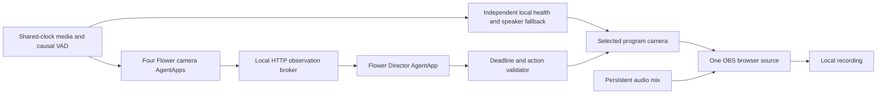

# Noesis

**Your autonomous production crew.** Named after the Greek *nóēsis*: thought and understanding.

An autonomous production controller for small panel discussions. Five synchronized camera views feed one continuous program. Camera agents report speaker/health evidence, a director proposes shots, and a local controller validates every action and keeps directing when agents are unavailable.

The runnable demo includes a control room, generated test feeds, an AMI replay adapter, real Flower 1.39.0 AgentApps, and an OBS WebSocket v5 bridge. **The default Flower director uses rules and makes no model calls. No model credentials are needed.**

## Run on Windows

```powershell
cd Noesis
.\start.ps1 -OBS
```

After completing the fresh setup below, open **http://127.0.0.1:8765**. Select **Synthetic test feeds** or **AMI replay** (after preparing its data), choose **OBS Studio**, then **Start session**. Select a camera to latch manual control; use **Resume autopilot** to release it. The fault controls alter the actual camera signal. **Stop** finishes the recording under `recordings/`.

`start.ps1` starts the controller and five bounded Flower runs (four camera agents and one director). `-OBS` also starts the workspace's portable OBS and prepares `NOESIS_Program`. Existing local services are reused. Keep the terminal open; Ctrl+C stops the session and managed agents. Portable OBS remains in the tray so it can preserve its configuration.

For only the dashboard and deterministic fallback:

```powershell
.\start.ps1 -PreviewOnly
```

## Fresh setup

Use Python **3.12** and [uv](https://docs.astral.sh/uv/getting-started/installation/). FFmpeg/ffprobe are needed for AMI validation and clip preparation. There is no JavaScript build step.

```powershell
git clone https://github.com/thesid42/Noesis.git
cd Noesis
$env:UV_CACHE_DIR = Join-Path $PWD '.runtime\uv-cache'
uv sync --python 3.12 --extra flower --extra dev
Copy-Item .env.example .env  # only if .env does not already exist
.\.venv\Scripts\python.exe scripts/setup_obs.py
.\.venv\Scripts\python.exe scripts/configure_obs.py
.\start.ps1 -OBS
```

The OBS installer downloads the official portable OBS 32.2.2 release and checks its SHA-256. Configuration lives under `.runtime/obs/`, with a dedicated profile and a generated WebSocket password in the ignored `.env`. This profile records only Noesis's browser source; desktop audio and the computer's microphone are disabled. Run the configuration script before launching portable OBS.

## What runs where



Each agent is submitted as a separate actual Flower run with its own run ID. The broker is application-managed HTTP, **not Flower Grid messaging**. On this laptop all five processes run locally. They do not constitute a demonstration across multiple physical devices.

The controller selects camera images within `/program`; OBS captures that single page in the actual `NOESIS_Program` scene. Internal camera selections and OBS recording acknowledgements are separate events. The bridge checks actual recording status after `StartRecord`/`StopRecord`.

The controller rejects expired/duplicate proposals, mismatched session and override epochs, unhealthy targets, and rapid cuts. Manual selection remains latched even if the source subsequently fails. Local health recovery continues independently of editorial/model work when autopilot is enabled. Natural replay completion finalizes the recording. If OBS disconnects before confirming Stop, the dashboard keeps Stop available for retry after reconnecting and blocks a new session until that recording is resolved.

Flower uses its pinned 1.39.0 control client to submit a FAB with a nonempty `user_prompt`; this was tested against the actual local SuperLink. See [Flower setup](docs/FLOWER.md) for standalone start/status/stop and the optional model path. Provider-backed inference is deliberately unverified until credentials are supplied.

## AMI ES2002a data

The app supports the four close-ups, Corner camera, four isolated headset channels, and headset mix. Mapping:

| Camera | Participant | Analysis microphone |
| --- | --- | --- |
| Closeup1 | A | Headset-0 |
| Closeup2 | C | Headset-2 |
| Closeup3 | D | Headset-3 |
| Closeup4 | B | Headset-1 |
| Corner | Room | No separate analysis microphone |

The normal downloader validates every complete file with ffprobe and a full FFmpeg decode, then records exact URLs, sizes, hashes, and retrieval time in a manifest:

```powershell
.\.venv\Scripts\python.exe scripts/prepare_ami.py --list
.\.venv\Scripts\python.exe scripts/prepare_ami.py --prepare-clip --clip-start 0 --clip-duration 150
```

During local development, a 20-second excerpt was prepared under `data/ami/ES2002a/prepared/clip-0-20/`. All ten derivatives passed decoding checks, and an actual OBS recording contained real camera changes and non-silent headset-mix audio. The common playable duration was about 19.93 seconds. This was a recording smoke test; the longer editorial evaluation remains outstanding. Datasets, recordings, runtime binaries, and private configuration are excluded from this repository; use the commands below to prepare your own local copy.

During this build, the official server repeatedly stalled on large responses. A bounded, resumable short-preview path uses the official, smaller RealMedia alternatives:

```powershell
.\.venv\Scripts\python.exe scripts/prepare_ami.py --preview-seconds 20 --preview-video-format rm --preview-audio-format rm --prefer-cached-prefixes --preview-audio-gain-db 18 --workers 16 --timeout 15
```

This fetches source prefixes, transcodes the selected beginning of each stream, and validates the resulting excerpt. A prefix is never labeled as a complete original file. The app discovers complete prepared sets automatically. The current set reuses cached AVI prefixes for Closeups 2–4 and RM prefixes for Closeup1, Corner, and all audio; `manifest.json` records every exact source, format, hash, output codec, and duration. A fixed +18 dB gain is applied uniformly to the five audio channels to compensate for their low level; the largest prepared sample peak is 0.531, below clipping. No channel substitution or annotation-based speech reconstruction is performed. Full downloads are needed to choose a later, more varied 2–3 minute demonstration.

AMI's [known problems](https://groups.inf.ed.ac.uk/ami/corpus/dataproblems.shtml) mention a badly worn headset for “participant 1” in this session. That wording does not establish a channel index. Listen to and visually verify participant/channel identity before substituting any lapel recording. The implementation does not silently substitute channels or use future transcript labels for perception.

The published [close-up playback file](https://groups.inf.ed.ac.uk/ami/AMICorpusMirror/amicorpus/ES2002a/browsable/ES2002a.closeup.smil) and [room playback file](https://groups.inf.ed.ac.uk/ami/AMICorpusMirror/amicorpus/ES2002a/browsable/ES2002a.sides.smil) start their RealMedia videos and headset mix at `0s`. This supports the shared starting origin; it does not replace a measured lip-sync check.

**Credits:** Source footage/audio: AMI Meeting Corpus, session ES2002a, AMI Project. [Corpus](https://groups.inf.ed.ac.uk/ami/corpus/) · [License](https://groups.inf.ed.ac.uk/ami/corpus/license.shtml) · [CC BY 4.0](https://creativecommons.org/licenses/by/4.0/). Noesis modifications, when used: excerpting, transcoding, fixed audio gain, camera selection, overlays, and labeled simulated faults. No endorsement is implied. Generated test feeds are original synthetic fixtures and are visibly identified as such. Carry these credits into any exported presentation/video description.

## Verification

```powershell
.\.venv\Scripts\python.exe -m pytest -q --basetemp=.runtime/pytest-check
.\.venv\Scripts\python.exe scripts/verify_demo.py
.\.venv\Scripts\python.exe scripts/verify_resilience.py
.\.venv\Scripts\python.exe scripts/verify_ami.py
```

The second command requires the local services, five live Flower agents and OBS. It starts a generated-input test recording, checks failure recovery, manual latch, pause/resume and real director actions, stops recording, decodes a recorded frame, and saves `.runtime/acceptance.json` plus `recordings/verified-program.jpg`. It is an active rehearsal and replaces the current demo session. `--without-flower` and `--preview-only` isolate individual integration layers.

The resilience command temporarily stops all five managed Flower runs, verifies that local directing continues with a degraded status, restores the runs, and checks that an external OBS recording stop appears in the controller. Results are saved in `.runtime/resilience.json`.

The AMI command records the installed excerpt through OBS, checks all five decoded cameras and audio range requests, verifies non-silent recorded audio, and checks automatic recording completion. Results are saved in `.runtime/ami-acceptance.json`. Like the other integration checks, it replaces the current session.

Verified on this machine on 28 September 2026: **30 tests passed**, five actual Flower AgentApp runs, one accepted Flower director cut in a **25.57-second OBS recording**, successful manual hold and pause/resume, and recording completion at replay end. One black-frame trial selected the healthy fallback **1,016 ms after the injection request began**. This measures controller recovery; it is not a repeated-trial guarantee or a measurement of the first healthy encoded video frame. Agent-outage fallback and external OBS stop detection also passed. See [validation notes](docs/VALIDATION.md).

The real AMI check also passed: a **20-second recording** with five healthy camera feeds, an accepted Flower director cut, later local speaker-following, and non-silent program audio (peak 0.424, RMS 0.032). Local evidence was saved as `recordings/verified-ami-demo.mp4` and `recordings/verified-synthetic-demo.mp4`; these recordings are excluded from the public repository.

These results were recorded before the rename to Noesis on 29 September 2026. Tests were not rerun for that rename.

The unit tests also generate AVI/WAV fixtures and exercise the actual OpenCV decoder and audio VAD. These checks establish working decoding, switching, and recording; they do **not** establish AMI editorial quality or measured real-footage lip sync. Verify A/V alignment and microphone quality on a longer selected AMI excerpt before presenting those as validated.

## Demo sequence

1. Start the generated or validated AMI input and show five live Flower run IDs.
2. Watch automatic speaker changes and the accepted director trace.
3. Black out the current camera; show its detected health failure and program recovery.
4. Select the room camera, show that manual control stays latched, then resume autopilot.
5. Stop and play the actual recording.

Current limits: this is a replay-based hackathon prototype, not live capture from arbitrary hardware. The model-free mode is complete; optional model inference, multi-machine execution, and real AMI editorial/synchronization evaluation are separate validation work. OBS renders at 30 fps; source JPEG sampling is bounded near 10 fps, so it is not yet a full-motion broadcast pipeline.
