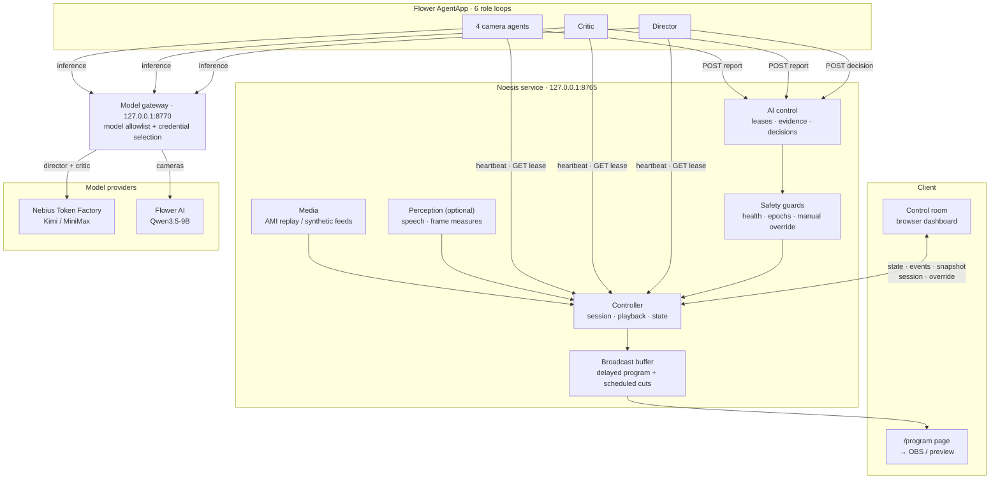

# Noesis

**An autonomous production crew for panel discussions.** Noesis directs five synchronized views into one continuous program, with a shared replay clock and persistent program audio.

## How it works

Noesis runs six AI roles: four camera agents, a critic, and a director. By default, one native local Flower AgentApp runs six independent role loops. Each camera and the critic refresh their own reports; the Director pins the latest sufficiently recent reports and chooses a shot without waiting for a new synchronized round. The local Flower runtime handles orchestration; model inference uses the configured remote Nebius endpoint through the local Noesis gateway. The hosted SuperGrid runtime remains available as an explicit alternative.

The models receive compact source measurements and AI role reports. Optional local background workers add recent English speech transcripts and lightweight frame measurements (blur, brightness, and frontal-face detection). The critic and Director also receive bounded history of shots that actually aired, separately from pending cuts. Raw frames/audio and reference annotations are not sent to Nebius. Transcripts are fallible and are not assigned to a speaker; face counts are measurements, not semantic scene understanding.

The local controller protects playback and output: it checks the current source is healthy, rejects stale or mismatched AI results, enforces manual override and replay epochs, and executes accepted camera choices. AI is responsible for editorial choices; deterministic guards handle safety and output integrity. If AI work is unavailable, the controller holds a healthy current shot; source-health recovery can select another healthy view. It does not substitute a rules-based speaker-ranking director.

Kimi is the default and verified model profile. The MiniMax selector is available when configured but was not run or verified for this demo. Provider keys stay in local configuration and the model gateway, outside the browser and AgentApp prompts. The dashboard distinguishes configured models from models that have returned a verified response.

## Architecture



- **Media** decodes the five AMI feeds (or synthetic test feeds) and the program audio mix; **Perception** optionally adds English speech transcripts and frame measurements (blur, brightness, frontal-face count) outside the inference and playback paths.
- **Controller** owns session, playback, and the state contract; it hands each AgentApp role a lease with compact source measurements and role reports, and never forwards raw frames, audio, or reference annotations to a provider.
- **AI control** manages per-role leases, pins the latest sufficiently recent camera and critic reports as director evidence, and records accepted results. **Safety guards** verify the target source is healthy, reject stale or mismatched results, and enforce manual override and replay epochs before a choice reaches the program.
- The **Flower AgentApp** runs four camera agents, a critic, and a director as independent loops sharing one persistent client. Each role fetches its own lease, calls the model through the local gateway, and posts a report (`/api/ai/report`) or decision (`/api/ai/decision`).
- The **model gateway** holds all provider keys, selects the credential by allowlisted model ID, and routes the director and critic to Nebius (Kimi) while the four cameras use Qwen3.5-9B through Flower. The browser and AgentApp prompts never receive provider keys.
- The **broadcast buffer** delays program video, audio, and scheduled cuts together by the selected delay, and serves the `/program` page consumed by OBS or the local preview.

The hosted SuperGrid runtime is an explicit alternative to the default local Flower mode; see [Flower runtime setup](docs/FLOWER.md).

## Control room dashboard

The dashboard at **http://127.0.0.1:8765** is a static page (`noesis/static/`, no build step) that polls `/api/state`, `/api/events`, and `/api/agents/snapshot`. It shows the delayed program preview, the five live source monitors, session and broadcast-delay controls, and manual override.

- **AI model responses** renders each role's latest accepted result with its verification state inline beside the title: cameras show `recommendation` / `confidence` / `reason`, the director shows `action` / `camera_id` / `reason`, and the critic shows `assessment` / `reason`. A role with only an older result is marked `PREVIOUS ROUND`; a stale profile is `PREVIOUS PROFILE`.
- **Flower agents** lists per-role heartbeats and run identity; **Distributed crew** shows the runtime, model, and recent trace; **Broadcast buffer** reports the input/output clocks, captured FPS, queued cuts, and missed deadlines.
- The interface ships day and night glassmorphic themes toggled from the top bar; the choice persists per browser.

## Camera model override

The four camera agents can use **Qwen3.5-9B through Flower**, with the director and critic staying on the selected Nebius Kimi profile. Configure these in the ignored `.env`:

```dotenv
FLWR_MODEL_API_ENDPOINT=https://api.flower.ai/v1/responses
FLWR_MODEL_API_KEY=<your Flower key>
NOESIS_CAMERA_MODEL=qwen/qwen3.5-9b
NOESIS_CAMERA_REASONING_EFFORT=none
```

Restart the launcher after changing these settings. The dashboard shows each role's configured model and its accepted response identity. The persistent gateway selects the correct provider credential by the allowlisted model ID; the browser and AgentApp receive no provider keys. An unset camera model uses the selected profile for all roles.

The requested 4B model was not listed by OpenRouter and Flower rejected that exact model ID; 9B was selected with user approval. In a camera-schema probe, `low` reasoning exhausted the 320-token budget without producing a report; `none` returned valid JSON, so reasoning is disabled for speed. These probes are not a general latency guarantee.

## Run the demo on Windows

Use Python 3.12 and `uv`. The default local runtime needs no Flower account, cloud coordinator, or SuperNode registration. Configure the Nebius profiles in `.env`; Kimi is the default and MiniMax remains selectable when configured, but was not live-tested. See [Flower runtime setup](docs/FLOWER.md).

```powershell
uv sync --python 3.12 --extra flower --extra dev --extra speech
.\.venv\Scripts\python.exe scripts\prepare_speech.py
Copy-Item .env.example .env  # skip if .env already exists
# Fill the Kimi endpoint, model, and key values in the ignored .env.
.\start.ps1 -OBS
```

The launcher starts the local Flower runtime, Noesis model gateway, and control room. Keep the terminal open; Ctrl+C stops services owned by the launcher. Omit `-OBS` to use preview output instead of OBS. On macOS/Linux, use `./start.sh --obs` or `./start.sh`.

Local runs use persistent inference connections by default. The equivalent Python launch command is:

```powershell
.\.venv\Scripts\python.exe scripts\run_demo.py --obs
```

The Flower AgentApp shares one persistent client across all six roles and sends model requests directly to the authenticated local gateway, bypassing Flower's per-request model subprocess. Use `--inference-transport flower` to select the original path. Hosted SuperGrid continues to use Flower model tasks. See [latency measurements](docs/PERFORMANCE.md).

To opt into the hosted SuperGrid path, first configure Flower's authenticated connection and register the six SuperNodes, then launch explicitly:

```powershell
.\.venv\Scripts\python.exe scripts\supergrid_agents.py setup
.\.venv\Scripts\python.exe scripts\run_demo.py --runtime supergrid --obs --model-profile kimi --duration-s 240
```

This hosted option uses the cloud coordinator and authenticated `@thesid42/noesis` federation. Its completed Kimi run is historical hosted-runtime evidence; it is distinct from the default local Flower mode. See [Flower runtime setup](docs/FLOWER.md) for the distinction and prior proof.

Open **http://127.0.0.1:8765**, choose Synthetic or AMI input and a broadcast delay, then start a session. The default five-second buffer delays program video, audio, and scheduled cuts together. Live source previews remain at the input clock. Choose a longer delay while stopped if decisions miss their output deadline; five seconds cannot guarantee hiding a seven-second request. Late decisions are rejected, and the current healthy shot is held. Synthetic feeds are visibly labeled and have no program audio. AMI replay uses the recorded headset mix; starting the session from the browser unlocks its audio playback. The `/program` page keeps the same mix across camera cuts and is the OBS browser source. `--obs` starts the configured portable OBS when needed and prepares its program scene. Omit `--obs` for preview output.

The speech preparation command downloads the small English Whisper model once into ignored local storage. Runtime startup never downloads models; missing optional speech dependencies/cache are shown as unavailable. Frame analysis is sampled at most once a second, speech uses four-second chunks, and both run outside the inference/playback path.

For local media preparation and OBS setup commands, see [Flower and demo setup](docs/FLOWER.md). There is no JavaScript build step.

## Media and attribution

The AMI ES2002a adapter uses four participant close-ups, one room view, four isolated headset channels for measured speaker evidence, and the continuous headset mix for program audio. It is replay of recorded footage, not live capture. The latest smoke test decoded five healthy feeds and finalized at EOF; see [validation status](docs/VALIDATION.md) for duration and audio measurements. The longer 2–3 minute editorial evaluation and fine lip-sync measurement remain outstanding.

Source footage and audio: AMI Meeting Corpus, session ES2002a, AMI Project. [Corpus](https://groups.inf.ed.ac.uk/ami/corpus/) · [License](https://groups.inf.ed.ac.uk/ami/corpus/license.shtml) · [CC BY 4.0](https://creativecommons.org/licenses/by/4.0/). Noesis modifications may include excerpting, transcoding, fixed audio gain, camera selection, overlays, and labeled test faults. No endorsement is implied. Carry this credit into exported demos.

## Project notes

- [Flower topology, configuration, and launch](docs/FLOWER.md)

- [Current verification and pending checks](docs/VALIDATION.md)

- [HTTP/API and state contract](BUILD_CONTRACT.md)

- [Product and evaluation plan](Noesis_Hackathon_Idea.md)
